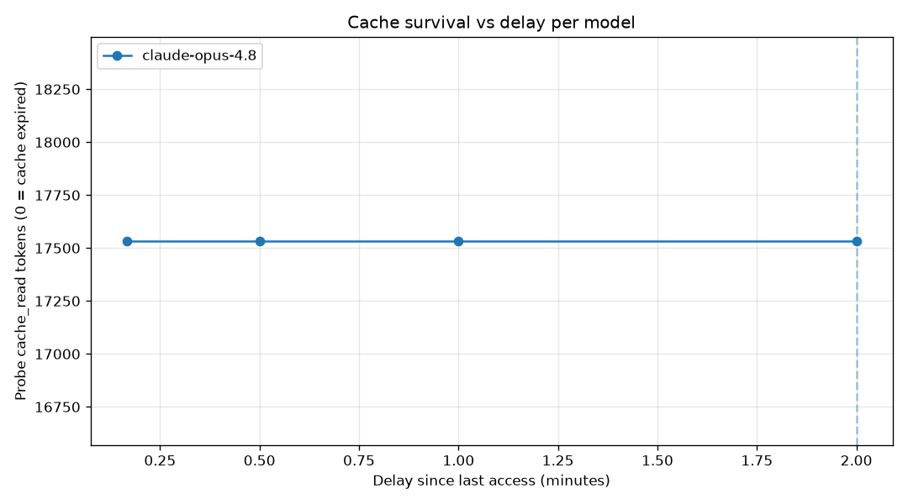
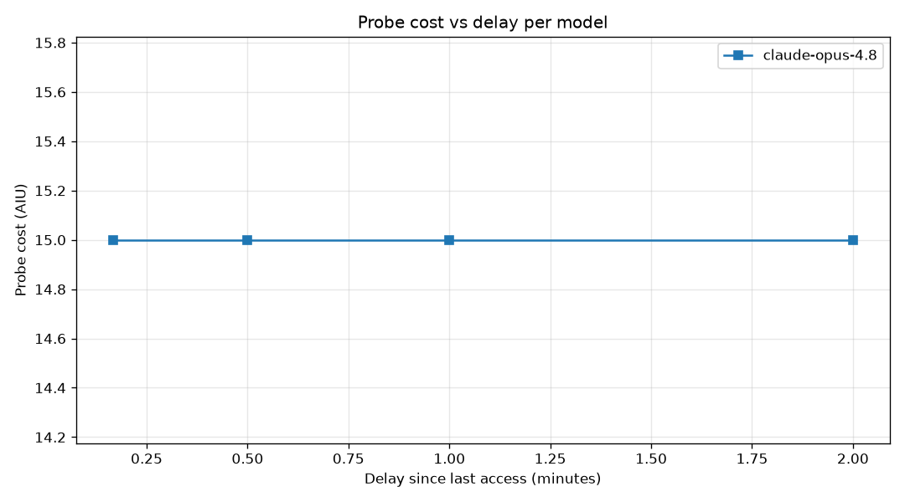

# Public Results

This report summarizes the public, GA-only measurements from the Copilot CLI cache-TTL harness. It intentionally excludes non-public model and account details.

Published data snapshot: 2026-06-23.

Source files:

- `data/public-model-summary.csv`
- `data/public-probe-matrix.csv`

## Executive Summary

The latest public report uses the cleaned result files in `data/` rather than the local raw `results/` directory. The measured cache lifetimes vary substantially by model family:

- Most Claude variants in this run expired around 4-5 minutes.
- `gpt-5.4-mini` stayed cached for about 15.5 minutes.
- `gpt-5.5` stayed cached for about 17.3 minutes.
- `gemini-3.5-flash` stayed cached for roughly 25 minutes, with a noisy boundary.
- `gpt-5-mini` and `gpt-5.3-codex` were still cached at the 30-minute test ceiling.
- `gpt-5.4` did not show a stable cache hit at the first 30-second probe in this public run context.
- `auto` is routed and should not be assigned one TTL value.

These are practical, account- and context-specific measurements. They should be treated as reproducible lower-bound observations for this harness, not as universal service guarantees.

The harness measures observed prompt-cache reuse TTL through Copilot CLI telemetry. It does not measure session lifetime, model memory, token limits, or an official product SLA.

## Model Summary

| Model | Status | TTL lower bound | TTL upper bound | Estimate | Notes |
| --- | --- | ---: | ---: | ---: | --- |
| claude-haiku-4.5 | measured | 225s | 255s | ~240s | Mixed result at 255s; about 4.0 min. |
| claude-opus-4.5 | measured | 255s | 277.5s | ~266s | Confirmed hits at 255s; miss at 277.5s. |
| claude-opus-4.6 | measured | 277.5s | 300s | ~289s | Confirmed hits at 277.5s; miss at 300s. |
| claude-opus-4.7 | measured | 255s | 277.5s | ~266s | Prefix hash changed mid-run; bracket still reported. |
| claude-opus-4.8 | measured | 277.5s | 300s | ~289s | Confirmed hits at 277.5s; miss at 300s. |
| claude-sonnet-4.5 | measured | 277.5s | 300s | ~289s | Confirmed hits at 277.5s; miss at 300s. |
| claude-sonnet-4.6 | measured | 255s | 277.5s | ~266s | Confirmed hits at 255s; miss at 277.5s. |
| gemini-3.5-flash | measured | 1200s | 1500s | ~1485s | Noisy boundary; mixed confirmation at 1500s. |
| gpt-5.4 | measured | 0s | 30s | <30s | No stable cache at the first 30s probe. |
| gpt-5.4-mini | measured | 918.75s | 937.5s | ~928s | Confirmed hits at 918.75s; miss at 937.5s. |
| gpt-5.5 | measured | 1031.25s | 1050s | ~1041s | Confirmed hits at 1031.25s; miss at 1050s. |
| gpt-5-mini | ceiling-limited | 1800s | n/a | >=1800s | Still cache-hit at the 30-minute ceiling. |
| gpt-5.3-codex | ceiling-limited | 1800s | n/a | >=1800s | Still cache-hit at the 30-minute ceiling. |
| auto | routed | n/a | n/a | n/a | Routed model varied; no single TTL is meaningful. |

## Probe Matrix

`H` means cache hit. `M` means cache miss. Repeated letters mean repeated probes at the same delay, for example `HHH` means three hits.

| Model | Probe outcomes |
| --- | --- |
| claude-haiku-4.5 | 30:H, 60:H, 120:H, 210:H, 225:H, 255:HM, 277.5:M, 300:M |
| claude-opus-4.5 | 30:H, 60:H, 120:H, 210:H, 255:HHH, 277.5:M, 300:M |
| claude-opus-4.6 | 30:H, 60:H, 120:H, 210:H, 255:H, 277.5:HHH, 300:M |
| claude-opus-4.7 | 30:H, 60:H, 120:H, 210:H, 255:HHH, 277.5:M, 300:M |
| claude-opus-4.8 | 30:H, 60:H, 120:H, 210:H, 255:H, 277.5:HHH, 300:M |
| claude-sonnet-4.5 | 30:H, 60:H, 120:H, 210:H, 255:H, 277.5:HHH, 300:M |
| claude-sonnet-4.6 | 30:H, 60:H, 120:H, 210:H, 255:HHH, 277.5:M, 300:M |
| gemini-3.5-flash | 30:H, 60:H, 120:H, 300:H, 600:H, 1200:H, 1500:HHM, 1518.75:M, 1537.5:M, 1575:M, 1650:M, 1800:M |
| gpt-5-mini | 30:H, 60:H, 120:H, 300:H, 600:H, 1200:H, 1800:H |
| gpt-5.3-codex | 30:H, 60:H, 120:H, 300:H, 600:H, 1200:H, 1800:H |
| gpt-5.4 | 30:M |
| gpt-5.4-mini | 30:H, 60:H, 120:H, 300:H, 600:H, 900:H, 918.75:HHH, 937.5:M, 975:M, 1050:M, 1200:M |
| gpt-5.5 | 30:H, 60:H, 120:H, 300:H, 600:H, 900:H, 975:H, 1012.5:H, 1031.25:HHH, 1050:M, 1200:M |
| auto | routed; mixed hit/miss outcomes across repeated runs, no single TTL |

## How The Measurement Works

1. A stable prompt prefix and tool-definition payload are used so the cache key is comparable across probes.
2. A hidden seed request populates the cache entry for that prefix.
3. The harness waits for a chosen delay interval.
4. A hidden probe request is sent with the same prefix.
5. `cache_read_input_tokens` indicates a cache hit; `cache_creation_input_tokens` indicates a miss or refresh.
6. A staircase sweep plus binary-search refinement narrows the threshold window.
7. Confirmation probes repeat boundary checks to reduce the chance of reporting a one-off transient result.

## Data Quality Notes

- The reported windows are lower-bound observations for this run and context.
- A warm cache at the start of a run can bias results upward if another CLI use shares the same stabilized prefix.
- Some boundaries are noisy. When a boundary is mixed, this report keeps the bracket and states that uncertainty explicitly.
- Routed `auto` results are not assigned a single TTL because the serving model can vary by request.
- The public report avoids local account configuration and non-public model details. Review generated artifacts before publishing them.
- The public tables are derived from reviewed `data/` files. Local `results/` files are useful for audit and reproduction, but they are not the sole source for this report.

## Artifacts

| Artifact | Description |
| --- | --- |
| `data/public-model-summary.csv` | Cleaned public model-level result summary used for this report. |
| `data/public-probe-matrix.csv` | Cleaned public probe matrix used for this report. |
| `results/results.csv` | Local probe-level measurements for the latest raw run; not the sole source for the public report. |
| `results/run_context.json` | Local reproducibility context; review before publishing. |
| `assets/cache_read_vs_delay.png` | Chart showing cache-read tokens by delay and model. |
| `assets/cost_vs_delay.png` | Chart showing probe cost by delay and model. |

## Charts

